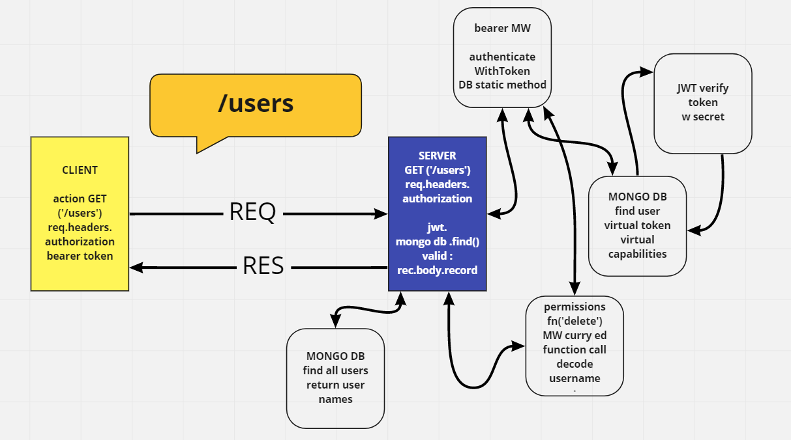

# auth-api

express api server with basic and bearer authentication and AccessControlList using mongoDb bcrypt and base-64

## Author: Fizzo Pannosch

**Version**: 1.0.0

<!-- (increment the patch/fix version number if you make more commits past your first submission) -->

### 
 links and resources 

#### 
 [heroku deployed site](https://fizzo-auth-api.herokuapp.com/) 

#### 
 [github actions](https://github.com/fizzo999/auth-api/actions) 

<!-- #### 
 [github pull request](https://github.com/fizzo999/server-deployment-practice/pull/1) 
 -->

#### 
 [ci/cd - github](https://github.com/fizzo999/auth-api/actions/runs/791249707) 

#### 
 [merged pull request - github](https://github.com/fizzo999/auth-api/pull/2) 

<!--  -->

## 
 UML DIAGRAM 

## Overview

building a basic express server with node.js. Writing our own tests with supertest and jest.

## Setup

git clone repo from github link:
https://github.com/fizzo999/auth-api.git

.env requirements
PORT - Port Number

npm install
(to install dependencies: express, dotenv, supertest, jest)

Running the app
npm start
Endpoint: /clothes for a list of items and /clothes/1 for the 1st item
Endpoint: /food for a list of food items and /food/1 for the 1st food item

Returns Array of Objects in case of GET
Returns success message in case of POST
Returns the updated object in case of PUT
Returns success message in case of DELETE

Tests
Unit Tests: npm run test

## Architecture

node.js based server that uses express library and dotenv package
tests performed with jest and supertest

## Change Log

04-28-2021 10:59pm - Application now has a fully-functional express server, with POST route ('/signup') and ('/signin') endpoints, mongodb working locally on my own machine. Also have AccessControlList implemented by meregin the two starter codes and changing the v2 routes (exact copy of v1 routes) to add middleware function call with (capabilities) as argument - thereby checking the token encrypted sign-in authorization status (user, editor or admin) against the virtual db field of .capabilities of that specific user that just signed back in.

## Credits and Collaborations

Number and name of feature: setup file structure, write server.js, index,js, 404.js, 500.js, test.js.yml - repo on github and deploy to heroku
Estimate of time needed to complete: 2 hours
Start time: 4:00 pm
Finish time: 7:00 pm
Actual time needed to complete: 3 hours

Number and name of feature: food routes and data model, bug fix, readme.md
Estimate of time needed to complete: 2 hours
Start time: 8:00 pm
Finish time: 11:00 pm
Actual time needed to complete: 3 hours
